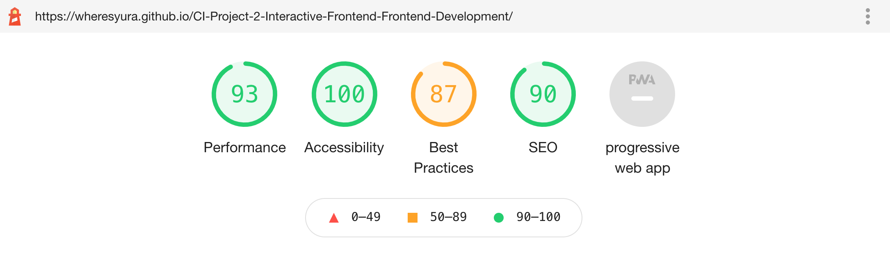

 
# CI: Project-2 Interactive Frontend Development - Using Coingecko API to get useful interactive information
 
[View the live project here.](https://wheresyura.github.io/CI-Project-2-Interactive-Frontend-Frontend-Development/)
 
I have chosen to build a website that connects to the CoinGecko API to display data and charts interactively based on your selection criteria chosen by the end user. I have chosen to do this project, since I am interested in the topic of cryptocurrencies. There has been huge growth in this asset class over the last year. Although a lot of it seems very speculative there are opportunities to profit from the growth in this area, even if it is speculative. For this reason I wanted to build a table that displays the data on the cryptocurrencies on various exchanges in a certain currency, volume, price range as well as graphing this data. The feature I built was not available on the CoinGecko website or CoinMarketCap, making this project very interesting for me as it uniquely expanded the functionality of the previous websites, one example being that it allows users to choose an exchange and pair it with ‘target’ currency they want to work with.
 
The goal with this website is threefold; 
1. I want to learn how to connect to an external APIs to and be able to display the data I want. Gaining valuable insights, and for me personally two things were important,price and market cap of these coins in the ‘target’ currency on the desired exchange.
1. I wanted to gain insights I was not able to get from the available websites on the web. I was able to do this, as currently you can’t search for the exchange coins with the desired base currency, i.e see all of the coins available on Binance(exchange) that trade in USDT (target). I was able to do this successfully.
1. The website is built for me to be able to make better decisions on which coins to invest in for the long run. As well as fulfilling the main requirements for this Milestone Project - creating a dynamic and interactive & responsive website. 
 
 
 
 
## 1.UX
 
### Project Goals
 
The primary goal is to connect to Coingecko’s API and display the relevant data when a user selects certain criteria. This website is to serve me and other potential users in making better potential decisions about which cryptocurrencies to invest in. Although there is a lot of speculation, if you find a good strategy you may be able to profit and this project is here to do this. As for example, you can filter coins that are very low in price and have a low market cap.
 
The secondary goal is to learn how to work with external APIs and libraries to create a website that serves a purpose and solves some problems. I want it to be useful and interactive and generate value for the end user. 
 
### User Goals
- A data driven website that allows you to check and sort all of the coins available on the crypto exchanges based on chosen criteria. 
- Fully interactive and display dynamic data based on users input.
- An ability to sort the table in ascending and descending orders all and displaying the output clearly in the table. 
- Easy to navigate and understand what the website is used for.
- Provide useful data displaying functionality via charts.
- Build a tool that I will use myself too. 
 
 
### Developer Goals
 
- Learn how to use javascript to connect with external API’s and also learn how to use external libraries to get additional functionality quicker and easier. 
- Make the data displayed clear, easy to understand as well as intuitive to the end user, and also very actionable. For example a user might sort the table based on price of coins or their market cap, and be able to find coins that still have a lot of potential growth.
- Excited to learn how to use javascript more and make this project part of my portfolio. 
 
 
### User Stories 
 
This project is aimed at cryptocurrency investors and enthusiasts for the reason, I want:
 
1. Have a clear explanation at the top of the site that will explain in three short steps how to use my website to get the most out of it.
2. The end user will use this mainly on their desktop so it will be mostly optimised for this, however it will still be compatible with tablets and phones.
3. For each navigation to be simple to use and easy to understand, so the end user can select the filters from a drop down menu he/she wants and the table and graph below will accurately display this data that they have chosen. 
4. For the fiter icons on the table at the top of it to work fully and accurately filter the data from lowest to highest or anything else that is needed. This information will be used by the end user to give them interesting insights about the coins that they should look into more and potentially invest in. 
5. For the chart to display information accurately and change based on what you have selected at the top. 
6. Have a feature where you can refresh the data on the graph so you can see the newest information, it will refresh your session storage data. 
7. Have very few icons and only once that make logical sense in accurate locations, for example one the refresh button. 
8. To show and display accurate new and relevant data that can not be found anywhere else like on websites like CoinGecko and CoinMarketCap.
 
 
### Design Choices
 
The website was designed so that a user can scroll from the top to the bottom and select all of the data they need to and all of the relevant (selected and filtered) data displays in the table and chart below. The design choice is therefore logical and follows the order of the page. It’s easy to navigate and clear from the hero text and image what the user needs to do.
 
#### Fonts
The website does not use any custom fonts, as there is very little text and it was not necessary to use a custom font for this project.
 
#### Icons
The website uses minimal iconography as I did not want to clutter my website, or compromise the user experience. I made this decision after watching the videos on the design principles, I decided to keep this minimal. I use it only when it makes logical sense and improves the user experience, for example like for the refresh button in my table.
 
#### Colours
The website uses all of the basic colours that bootstrap offers, I experimented with different colour pallets from bootstrap but decided on using the simple and most basic once, as colours are not the main focus of the project. I wanted to keep the website clear and found that the white table did this best.
 
For the colours on the bar chart I got rid of all of the given colours and instead used one red colour. For the pie chart I used all of the default colours.
 
#### Styling
Most of my styling and responsiveness was done using bootstrap built in functionality offered by bootstrap. The only times I used my custom CSS was in making the front cover of the website. With the bootstrap classes I tried to use the most basic options they had available, since the purpose of this website is not for design appeal but to look at data and filter it accurately.
 
All sections have the same font and spacing between them, making them consistent and keeping the websites look similar therefore providing a user friendly and familiar experience.
 
#### Backgrounds
The single time I used a background image as the hero cover I took it from Google images, also the logo was taken from Google images too. 
 
### Wireframes
The wireframes were created using pen and paper during the scoping part of the project, when I planned the design of this website for the desktop and be responsive version on mobile and tablet.
 
- [Mobile Version](assets/mockups/wire_phone.jpg)
- [Tablet Version](assets/mockups/wire_tablet.jpg)
- [Web Version](assets/mockups/wire_desktop.jpg)
 
 
## 2.Features
 
The website has 5 main features:
 
### Existing Features
- Feature 1 - The hero image and quick text explaining what the website is about and how to use it.
- Feature 2 - A drop down menu with choices that you can select to filter the information by.
- Feature 3 - A dynamic table that displays only the filtered information, after you choose it from the drop down menus.
- Feature 4 - This table has some cool functionality like the ability to filter in various orders once you click on it, for example the price from highest to lowest, and reverse of this.
- Feature 5 - A bar and pie chart that displays information visually, after you have selected it in the drop down menu. This information is displayed for each change to the dropdown menu. 
 
 
 
 
 
### Features Left to Implement
- Future Feature 1 - a feature which would allow you to add all of the logos of each of the coins to the table.
- Future Feature 2 - a feature that would do an analysis of the whole collection of coins, and look for patterns of those coins that fulfill ‘investment criteria’ for example low price and low market cap, as this might mean a lot of growth, maybe create a new table with these.
- Future Feature 3 - at the moment the way the way the number of requests to the API is done by hardcode, would be nice to have this more dynamic, where you don't need to change the (page number) constant to view more data.
- Future Feature 4 - a dark mode button, that would change the whole look and feel of the website from white to dark, and dark to white when clicked back.
- Future Feature 5 - Be able to get more information from the API, like things like the historic price and market cap, this would be useful if you looked at price drops of say 50%, as if it’s a good project it could be a really good buying opportunity.
- Future Feature 6 - Getting rid of the unnecessary decimal points for the volume and volume by price column.
 
 
## 3.Technologies Used
 
### Languages Used
 
-   [HTML5](https://en.wikipedia.org/wiki/HTML5)
-   [CSS3](https://en.wikipedia.org/wiki/Cascading_Style_Sheets)
-   [JavaScript](https://en.wikipedia.org/wiki/Cascading_Style_Sheets)
 
### Frameworks, Libraries & Programs Used
 
1. [Bootstrap](https://getbootstrap.com/)
    - Bootstrap was used to assist with the responsiveness and styling of the website.
2. [Font Awesome:](https://fontawesome.com/)
    - Font Awesome was used on all pages throughout the website to add icons for aesthetic and UX purposes.
3. [jQuery](https://jquery.com/)
    - jQuery came with Bootstrap and with DataTables to create some of the functionality for the filtering in the table.
4. [Git](https://git-scm.com/)
    - Git was used for version control by utilizing the Gitpod terminal to commit to Git and Push to GitHub.
5. [GitHub](https://github.com/)
    - GitHub is used to store the project's code after being pushed from Git.
6. [DataTables](https://datatables.net/)
    - DataTables was used to display the data from the API in a table as well as filtering it within the table.
7. [Chart.JS](https://www.chartjs.org/)
    - Chart.JS was the library used to be able to use the graphing abilities such as creating bar charts and pie charts.
8. [CoinGecko API](https://www.coingecko.com/en/api)
- CoinGecko API was used to get all of the information for each cryptocurrency on each exchange. 
 
 
 
## 4.Testing
- User interactivity - worked as expected.
- Data & DOM manipulation - worked as expected.
- App specific - worked as expected.
 
1. When the user selects a dropdown menu the data in the tables and charts should be updated. 
- On both mobile and desktop a dropdown was selected and changed to a different exchange.
- Data updated in the table successfully.
- Data updated in the charts successfully.
- Google chrome dev tools were used to check for the API call - success. 
2. The same procedure was repeated on each device for each of the dropdown menu items, in different combinations for the exchange, target currency, price range and volume.
- Data updated in the table as intended successfully.
- Data updated in the chart as intended successfully.
3. Each header of the table was checked that it functions as intended and filters the data correctly.
- Clicking on base heading filters the data alphabetically.
- Clicking on the last price heading filters the data from lowest to highest number.
- Clicking on the volume heading filters the data from lowest to highest number.
- Clicking on the volume * price heading filters the data from lowest to highest number.
- Clicking on the market cap heading filters the data from lowest to highest number.
 
All of the dropdowns worked as intended, also the page scaled appropriately to each device and filled the page as needed, optimising the content for that device.
 
#### Using Code Validators & Lighthouse
 
- I used the [W3C](https://validator.w3.org/) and was able to solve all problems associated with my code, and pass all of the tests except the once not on my url link, from other resources I used. 
- I used the [Html validator](https://validator.w3.org/) and was able to solve all problems and had no issues with my html, I did get a score of four warnings but they were not errors.
- I used the 	[Jshint](https://jshint.com/) and was able to not get any errors but I did get 51 warnings, most of which seemed like they were just browser dependent.
- I used [Lighthouse click here for the report](assets/lighthouse/lighthouse.pdf) in the developers tools and was able to get a good score under those parameters.
 

 
#### Discovered & Solved Bugs
 
1. The first problem I encountered was with 'Cross-Origin Resource Sharing (CORS)' when I tried to work with the [Coinmarketcap.com](https://coinmarketcap.com/api/documentation) API. I installed [Moesif CORS changer](https://chrome.google.com/webstore/detail/moesif-origin-cors-change/digfbfaphojjndkpccljibejjbppifbc) to overcome this problem after watching a tutorial but realised that person marking my site will need this too. So I went looking for other Crypto API's and came across [Coingecko](https://www.coingecko.com/api/documentations) which I used and solved this problem.
 
2. Another problem solved after consulting with my dad, was saving the information in session storage, as without doing this you will be making a big request of data to the API. Since the data needs to be stored as a string, in some cases we had to turn data into string-like, and in other cases we had to turn it back to an object to use in the programme.
```python
 
sessionStorage.setItem('coins', JSON.stringify(coins));
sessionStorage.setItem('moreCoinsData', this.responseText);
 
 
And back to object object
 
coins = JSON.parse(saved);
moreCoinsData = JSON.parse(sessionStorage.getItem('moreCoinsData'));
 
```
 
3. Another bug that occurred that was solved, was around the charting of the graphs. The graph did not work easily for each new request, I had to read the chart.js documentation and find in it that it was a requirement to destroy the chart to use it again. 
 
```python
 if (myChart !== null) {
     // destroying so can use again for new request
   myChart.destroy();
 }
 
```
 
 
## 5.Deployment
 
### GitHub Pages
 
The project was deployed to GitHub Pages using the following steps...
 
1. Log in to GitHub and locate the [GitHub Repository](https://github.com/)
2. At the top of the Repository (not top of page), locate the "Settings" Button on the menu.
    - Alternatively Click [Here](https://raw.githubusercontent.com/) for a GIF demonstrating the process starting from Step 2.
3. Scroll down the Settings page until you locate the "GitHub Pages" Section.
4. Under "Source", click the dropdown called "None" and select "Master Branch".
5. The page will automatically refresh.
6. Scroll back down through the page to locate the now published site [link](https://github.com) in the "GitHub Pages" section.
 
### Forking the GitHub Repository
 
By forking the GitHub Repository we make a copy of the original repository on our GitHub account to view and/or make changes without affecting the original repository by using the following steps...
 
1. Log in to GitHub and locate the [GitHub Repository](https://github.com/)
2. At the top of the Repository (not top of page) just above the "Settings" Button on the menu, locate the "Fork" Button.
3. You should now have a copy of the original repository in your GitHub account.
 
### Making a Local Clone
 
1. Log in to GitHub and locate the [GitHub Repository](https://github.com/)
2. Under the repository name, click "Clone or download".
3. To clone the repository using HTTPS, under "Clone with HTTPS", copy the link.
4. Open Git Bash
5. Change the current working directory to the location where you want the cloned directory to be made.
6. Type `git clone`, and then paste the URL you copied in Step 3.
 
```
$ git clone https://github.com/YOUR-USERNAME/YOUR-REPOSITORY
```
 
7. Press Enter. Your local clone will be created.
 
```
$ git clone https://github.com/YOUR-USERNAME/YOUR-REPOSITORY
> Cloning into `CI-Clone`...
> remote: Counting objects: 10, done.
> remote: Compressing objects: 100% (8/8), done.
> remove: Total 10 (delta 1), reused 10 (delta 1)
> Unpacking objects: 100% (10/10), done.
```
 
Click [Here](https://help.github.com/en/github/creating-cloning-and-archiving-repositories/cloning-a-repository#cloning-a-repository-to-github-desktop) to retrieve pictures for some of the buttons and more detailed explanations of the above process.
 
 
## 6.Credits
 
### Code
 
- Template code for the navbar was taken from [GetBoostrap](https://getbootstrap.com/docs/5.0/components/navbar/) and heavily modified to suit the site's needs.
- Template code for the hero image and text was taken from [w3schools](https://www.w3schools.com/) and heavily modified to suit the site's needs.
- Template code for the charts was taken from [Chart.js](https://www.chartjs.org/docs/latest/samples) and heavily modified to suit the project's needs.
- When I was stuck on a problem for a long period of time I would go to my dad, who is a software developer and he would help me find a solution, as well as explain or point me in the direction of where to look for the relevant information online. 
 
### Content
- The content of the API came from [CoinGecko’s API](https://www.coingecko.com/en)
 
### Media
- The single hero photo and logo used in this site were obtained from Google Images.
 
 
### Extra Resources Used
 
#### Callback, async
https://www.youtube.com/watch?v=_AyFP5s69N4&t=3s
https://www.youtube.com/watch?v=568g8hxJJp4&t=83s
https://www.youtube.com/watch?v=uPCxgnLOuiQ
https://www.youtube.com/watch?v=pTbSfCT42_M&t=430s
 
#### Arrays, Dictionaries
https://www.youtube.com/watch?v=oigfaZ5ApsM
https://www.youtube.com/watch?v=VIQoUghHSxU
https://www.youtube.com/watch?v=G3BS3sh3D8Q
https://www.youtube.com/watch?v=EnYlhbpzhU4
https://www.youtube.com/watch?v=4_iT6EGkQfk&t=18s
https://www.youtube.com/watch?v=A0g7sga28Zg
https://www.youtube.com/watch?v=qmnH5MT_luk&t=445s
https://www.youtube.com/watch?v=VmicKaGcs5g
https://www.youtube.com/watch?v=_ApRMRGI-6g
 
#### Charts & DataTable & API
https://www.youtube.com/watch?v=024yLQ1K1Ws&t=151s
https://www.youtube.com/watch?v=sE08f4iuOhA&t=9s
https://www.youtube.com/watch?v=5-ptp9tRApM&t=598s
https://www.youtube.com/watch?v=EmvIYSCDLts
https://www.youtube.com/watch?v=7Gdok1BPECw&t=197s
 
 
### Acknowledgements
 
- My Dad who has helped me with any technical questions that I had throughout this project. Explaining anything I did not in ways that was easy to understand.
- Thank you to my project mentor [Reuben Ferrante](https://uk.linkedin.com/in/reuben-ferrante) for his continued guidance and support during this project. 
- The lesson videos from Code Institute.
- I received inspiration for this project from:
  - https://whatwillwewatch.com/ 
  - https://coinmarketcap.com/ 
 
 
 
 


