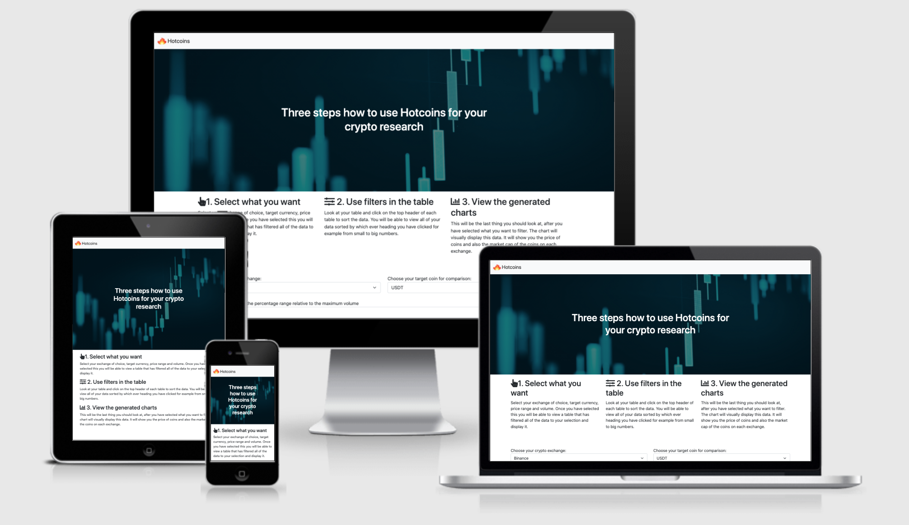

# CI: Project-1 User Centric Frontend Development - Trinity College Scholarship Application

I have decided to build a website for my application for a scholarship from Trinity College in Dublin, Ireland. As I have recently got in to a Masters programme at TCD. I have found out that there was an opporunity to recieve a partial scholarship and decided to build a website as an additional piece of work for my application.  

My goal with the website is very simple, first have a look at the rich history of Trinity College, then showcase my best side and show them why I am a perfect candidate for this scholarship. Including my own personal story, some of my achievements to date and why I will be a good amabsassador for them in the future. This website will serve a very niche purpose and I will keep this in mind as designing it. 
 
## 1.UX

### Project Goals 

The primary goal is to provide a clean, intuitive and userfriendly website for the admission team of Trinity College, to showcase my best side and help me to potentially get this partial scholarship. The website will only be viewed by the admission team as a supporting project to my main submisson. 

The secondary goal is to learn how to make stunning and beautiful websites that elicit a postive emotion in the end user. I want it to be educational about TCD's rich history and also interesting and iteractive for viewers read my story. 

### User Goals 
- A brochure website to view an extra submission by a student who wants to try and recieve a scholarship. 
- A vissualy applealing and well functioning website. 
- An ability to download the students CV, and contact them. 
- Easy to navigate, with an intuitive feeling on the website. 


### Developer Goals 

- A well thought out and easy to navigate brochure website with some stunning css and html. 
- Some good basic functionality such as the download of CV, contact button, and gallery.
- A project I am excited to learn from and make it part of my portfolio.


### User Stories  

As a user that is part of the addmissions team at Trinity College, I want:

1. To see that sufficient effort went into this project and there are no spelling mistakes, so that I can be sure that this student deserves to recieve the partial scholarship.
2. To see good use of colours on the website that are also alligned with Trinity College's brand colours, so that I can easier relate to the website and understand it's purpose easily. 
3. To be able to navigate the website easily and intuitively, so that I do not get a negative emotion viewing the website. 
4. To be able click on each link and it's content either neatly opens on the website I am viewing or on a seperate tab if it's from a diffent source, so that I have a pleasant user experience that has a natrual flow to it.
5. To be able to easily understand that an action I have done was perfomed or is about to be performed, for example if I am about to click on a button the clour of this button changes, so that I can understand when I am about to click on a new action. 
6. To have no doubt that this website was carefully crafted and nothing told was an exageration or untruth, so that I can be sure that I can trust this individual. 
7. To see easy to understand visual icons I am familiar with like the social media tags we all know or the download button, so that I can easily use visual ques to navigate the website. 

### Design Choices 

The website was designed so that it clearly shows the admission team at Trinity College all of the information that they need to know about the student who wishes to recieve the partial scholarship. The website needs to be easy to navigate and intuitive to these users. 

#### Fonts 
The website was designed using the ‘Poppins’ font and the ‘Sans-Serif' font as the fall back option for the website, if Poppins was not available. I found this font on Google fonts website, and think it makes my website look modern and very clean, this was the look I was going for.

#### Icons 
The website uses minimal iconography as I did not want to clutter my website, or compromise the user experience. I made this decision after watching the videos on the design principles, I decided to keep this minimal. I use it only when it makes logical sense and improves the user experience, for example like for the download button in my navigation bar or the social icons.

#### Colours 
The website was designed with two main colours in mind, shades of light blue and orange. I believe these colours complement each other really well and work together nicely. The other reason I have chosen these colours is because Trinity College’s brand uses these colours, since my main target audience will be Trinity College, I have decided to use these colours. 

The secondary colour is green, this was my own decision to use this colour and I think it makes my website look more fresh and really pops my last section, where there is a lot of green in my images. 

#### Styling 
I tried to keep the same look for all of my buttons and borders, padding etc to make my website consistent and clean looking. I initially did not do this and then decided to start the project from the start following these principles. 

All sections have the same font and spacing between them, making them consistent and keeping the websites look similar therefore providing a user friendly and familiar experience. 

#### Backgrounds 
All background images were either taken from Google images or were my own photos. All images chosen by me were edited further in photoshop to make them unique and specific for this website. I have done this intentionally to give the website a unique and memorable look. 

#### Video Files 

The video files were taken directly from the YouTube video of the university for which I was making the website, I then edited this video in iMovie to make it shorter, changing slightly the colour grading and cutting the long video into a short 43 second clip. I then played it on loop on the website, as well muted it for best user experience. 

### Wireframes 
 
The wireframes were created using [Balsamiq](https://balsamiq.com/) during the scoping part of the project, when I planned the design of this website for the mobile, tablet and desktop version. 


- [Mobile Version](assets/mockups/mobile_mockups.pdf)
- [Tablet Version](assets/mockups/tablet_mockup.pdf)
- [Web Version](assets/mockups/desktop_mockup.pdf)


## 2.Features

The website has 4 main features that are all very basic since it is my first project. 
 
### Existing Features
- Feature 1 - video on the home page - allows users admission team to visually see the effort that was put into my application, by viewing the website.
- Feature 2 - carousel - allows the user viewing the website to view some images and texts as well as go to the next screen, by clicking the arrows back and forward.
- Feature 3 - contact page - allows users to type dummy text and submit a query into the contact page, that will not be saved for now. 
- Feature 4 - a google map - allows users to view where on the map trinity college is.


### Features Left to Implement
- Future Feature 1 - a section that automatically updates to the website my work that I publish to Medium.com
- Future Feature 2 - a gallery that automatically displays my photos from Instagram.
- Future Feature 3 - a section on the website that captures the person's email automatically and can send emails through services like mailchimp. 


## 3.Technologies Used

I used HTML & CSS and the web framework I used was Bootstrap. Some of the tools I used were Balsamiq for the wireframes. I also used Adobe Photoshop for creating custom images and iMovie to edit the video on the homepage. 

- [Bootstap](https://getbootstrap.com/) - framework used for the website.
- [Balsamiq](https://balsamiq.com/)- used for wireframes.
- [Adobe Photoshop](https://www.adobe.com/ie/creativecloud.html?mv=search&sdid=MQH8S7GK&ef_id=Cj0KCQiAx9mABhD0ARIsAEfpavQNhXRa8M4gxWJiInmSaAWhJRXqoNAjGKTBqrBNXDQTkjRpRUrR_h8aAkuwEALw_wcB:G:s&s_kwcid=AL!3085!3!394398083730!e!!g!!adobe!1423510982!55397704265&gclid=Cj0KCQiAx9mABhD0ARIsAEfpavQNhXRa8M4gxWJiInmSaAWhJRXqoNAjGKTBqrBNXDQTkjRpRUrR_h8aAkuwEALw_wcB)-used for editing images.
- [iMovie](https://www.apple.com/imovie/)- used for editing the video.


## 4.Testing

Testing client stories from UX section of README.md

1. To see that sufficient effort went into this project and there are no spelling mistakes, so that I can be sure that this student deserves to receive the partial scholarship.
* i . I used free services like Grammarly which corrects your spelling as you write. Other content came from verified and credible sites like Wikipedia. 
* ii. You can see that I put time and effort into the design and layout of the website and this should be immediately clear. 

2. To be able to navigate the website easily and intuitively, so that I do not get a negative emotion viewing the website. 
* i. I was able to design in a way that is very intuitive to use both as a mobile version and desktop version.
* ii. Each of the navigations does what it's meant to and the links work and direct you to the correct part of the website. Checked each one manualy.
* iii. When you click on the logo you are brought back to the website as intended.

3. To be able to click on each link and it's content either neatly opens on the website I am viewing or on a seperate tab if it's from a different source, so that I have a pleasant user experience that has a natural flow to it.
* i. Where it makes logical sense a new tab is correctly opened and you can see each new website that this site links to open in a new tab. I have tested manualy all of the links and all of them work. 
* ii. In other instances the site navigates to the correct part of the site with a great user experience. 

4. To be able to easily understand that an action I have done was performed or is about to be performed, for example if I am about to click on a button the colour of this button changes, so that I can understand when I am about to click on a new action.
* i. This has been achieved with CSS and tested, anytime you hover over any button this happens. The button is highlighted and you can see your action is about to be performed.
* ii. The buttons press smoothly and you and action occurs with no delays.

5. To see easy to understand visual icons I am familiar with like the social media tags we all know or the download button, so that I can easily use visual cues to navigate the website.
* i. Minimal icons have been used on the website, however there are a few strategic locations where they have been placed, they all work as intended and when you click on them you are brought to a new tab in your browser and the correct link opens. 

#### Using Code Validators & Lighthouse

- I used the [W3C](https://validator.w3.org/) and was able to solve all problmes associated with my code, appart from one small erorr to do with my map and using a % sign in it. My wesbite still worked. I was able to resolve all other issues.
- I used the [Jigsaw](https://jigsaw.w3.org/css-validator/) and was able to solve all problems and had no issues with my CSS.

- I used [Lighthouse click here for the report](assets/lighthouse/lighthouse.pdf) in the developers tools and was able to get a good score under those parammaters. 

#### Discovered & Solved Bugs 

1. The background hero text in the centre of the video -  found how you could solve the problem on images and applied it to the video.

```python

.home-video {
	position: relative;
}

video {
	width: 100%;
	height: 100%;
	object-fit: cover;
}

.hero {
	position: absolute;
	bottom: 50%;
	left: 50%;
	transform: translate(-50%, 50%);
}
```


2. Adding background for the hero text so you can read it easier

```python
.hero {
	background-color: #00000096;
	border-radius: 3em;
	padding: 3em;
}
```


## 5.Deployment

I followed the instructions on the web to deploy my project onto the github pages. This was relatively straight forward all I had to do was change the settings, specifically under the GitHub pages. I changed the source branch to ‘master’ and the folder to ‘root’ and was able to create a github page with my website. 

To run this code locally do the following. 
1. Download the code repository to your computer - can do this by pressing the “download zip” on the top right of the repository. 
2. You can then open all of the files using your preferred editor, like brackets or gitpod. 
3. You will be able to open the file locally after you do this (since it is a single page file). 
 

## 6.Credits

### Code 

- Template code for the navbar was taken from [GetBoostrap](https://getbootstrap.com/docs/5.0/components/navbar/) and heavily modified to suit the sites needs. 
- Template code for the footer was taken from [MDbBootstrap.com](https://mdbootstrap.com/) and used as the structure on top of which I built and styled the footer, I used a mixture of Goolge searches and the tutorials provided by Code Institute to get the desired look. 
- Template code for the cards was taken from [GetBoostrap](https://getbootstrap.com/docs/5.0/components/card/) and heavily modified to suit the sites needs. 
- Template code for the carousel was taken from [GetBoostrap](https://getbootstrap.com/docs/5.0/components/carousel/) and  modified to suit the sites needs. 
- Template code for the contact page was taken from [GetBoostrap](https://getbootstrap.com/docs/4.0/components/forms/) and modified to suit the sites needs. 
- Template code for the Trinity page used [Startbootstrap](https://startbootstrap.com/previews/one-page-wonder) concept which was edited to suit the pages needs.

### Content
- The text for section 'Trinity' was copied from the [Wikipedia about Trinity College](https://en.wikipedia.org/wiki/Trinity_College_Dublin)

### Media
- The photos used in this site were obtained from Google Images and my personal photos all of which I edited in Adobe Photoshop. 
The video was obtained from this [Youtube link](https://www.youtube.com/watch?v=DbZALsDfLuU) and edited using iMovie. 

### Acknowledgements

- I received inspiration for this project from viewing different sites I have previously seen that I liked, as well as looking at the [Awwwards](https://www.awwwards.com/) site and searching for bootstrap related websites and choosing elements I really liked. 